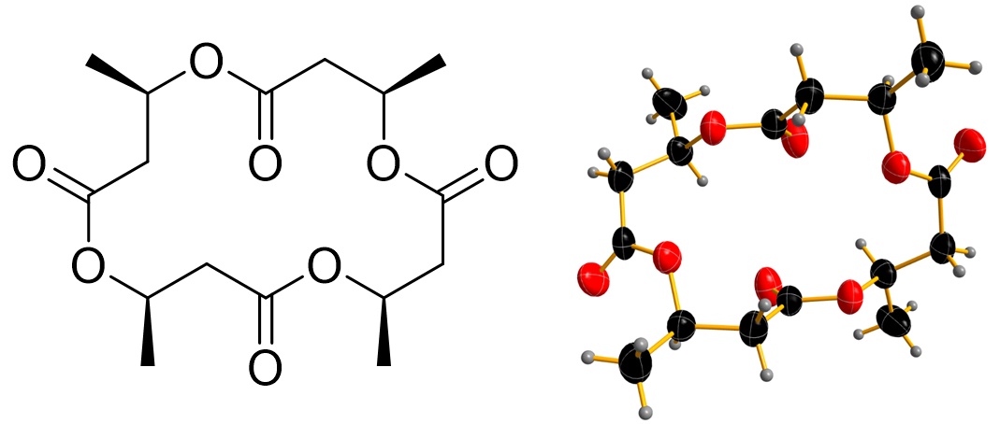
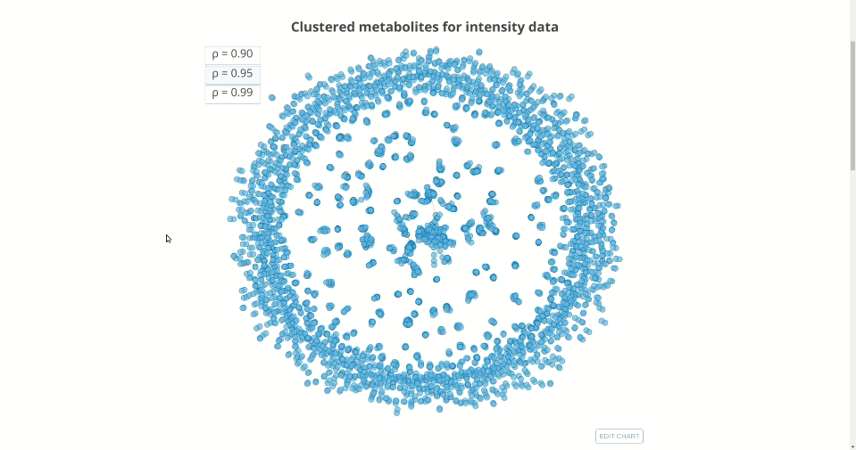

## Geographical chemotypes

This repository contains the accompanying code to the paper [*Focused natural product elucidation by prioritizing high-throughput metabolomic studies with machine learning*](https://www.biorxiv.org/content/10.1101/535781v1) by Tobias _et al._

We train a [gradient boosting model](#resources) to classify bacterial metabolite data obtained from soil samples into corresponding to _Photorhabdus_ or _Xenorhabdus_. In conjunction with a [recently-developed feature attribution approach](#resources), we determine the most relevant features that set these two genera apart.

We find that the soil environment, given by the geographical metadata, does not affect the classification of the two genera, highlighting the essential role played by their respective host nematode in providing an environment for them. We further identify a family of compounds that can, by themselves, predict the bacterial genus in unseen data with over 90% accuracy. This is important because new data will not necessarily contain values for all features in a full model, and a peak-matching procedure needs to be carried out for those compounds that are present in both the original and new datasets. One of the compounds in this family has been isolated and purified, and you can see its chemical structure below:

### Contents
The repository is structured as follows:
- [`code`](./code/) contains Jupyter notebooks taking you trough the steps of model construction and the results obtained. In sequential order:
    1. [`data-cleaning.ipynb`](./code/data-cleaning.ipynb) shows the removal of blanks from the raw data and the separation into intensity and AUC (and zeroed AUC) datasets, plus the tidying up of the metadata.
    2. [`model-features.ipynb`](./code/model-features.ipynb) shows additional data preprocessing steps, and the construction of the different datasets used for training by removing zero- and near-zero-variance features from the data, as well as clustering highly-correlated features.
    3. [`cross-val.ipynb`](./code/cross-val.ipynb) shows the actual performance of the classifier for the different datasets, and the determination of most relevant predictors.
    4. [`test-pred.ipynb`](./code/test-pred.ipynb) contains the predictions of the single-feature models for the test data, after determining the closest match in metabolite properties.

- [`data`](./data/) contains both the raw data and the files generated by the notebooks. Due to GitHub restrictions on file size, only some of these files can be displayed directly in the repository tree. The full data directory can be downloaded from [here](https://github.com/cparrarojas/geographical-chemotypes/releases/download/1.0/data.zip).

### Clustered metabolite data

An interactive visualisation of the clustered metabolites can be found [here](https://cparrarojas.github.io/blog/2019/02/geographical-chemotypes/). By hovering over a given node, you can see the metabolite retention time and m/z ratio, as shown below.

Change the correlation threshold to visualise the different sets of clusters.

**Note:** Only clusters with 250 or fewer members are displayed.

### Resources

- [`LightGBM`](https://github.com/Microsoft/LightGBM): Light Gradient Boosting Machine.
- [`shap`](https://github.com/slundberg/shap): A unified approach to explain the output of any machine learning model.
